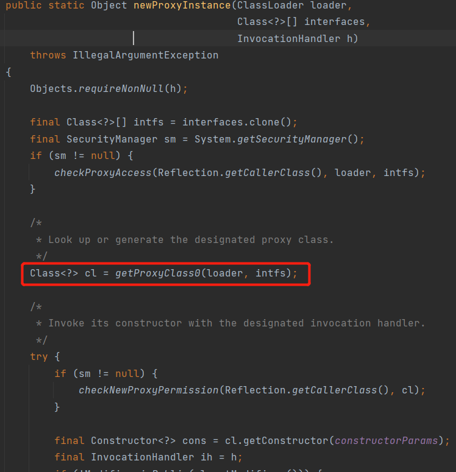
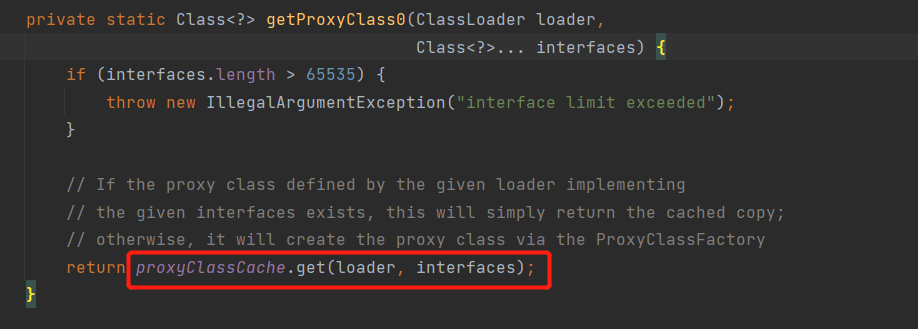
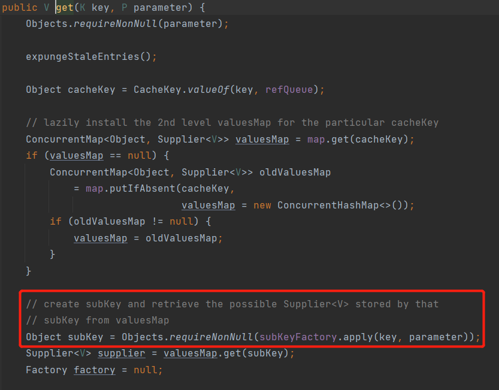
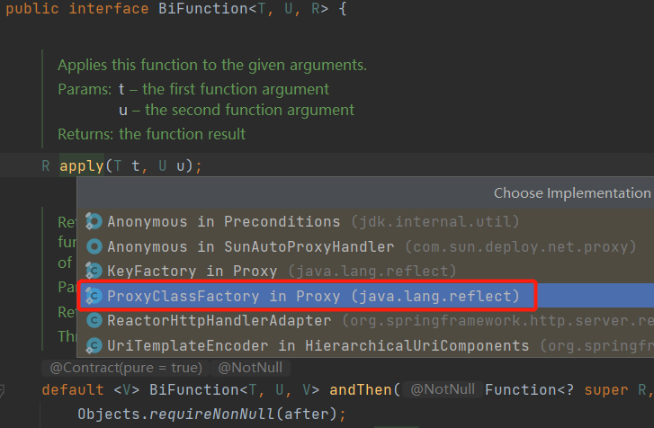
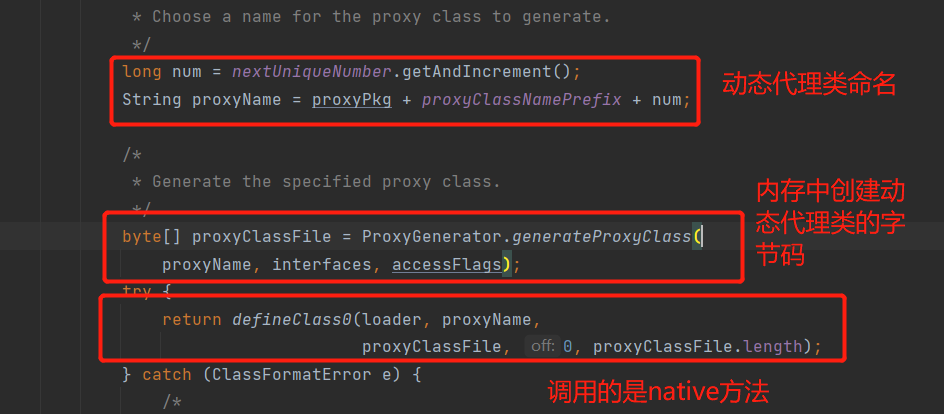

#代理（proxy）
+ 静态代理
+ 动态代理
####静态代理
+ 被代理的类(A)
+ 代理类(b)
+ 调用者(C)

被代理的类(A)和代理类(B)需要实现同一个接口，代理类(B)封装被代理类(A)的引用，
方法中封装被代理类(A)的业务方法，而调用者(C)直接使用代理类(B)的方法即可。

####动态代理
+ 创建一个类实现InvocationHandler接口，实现invoke方法
+ 该类通过Proxy.newProxyInstance获取到代理类，自动调用invoke方法。
  #####参数
    + newProxyInstance(ClassLoader loader, Class<?>[] interfaces, InvocationHandler h)
        + loder:被代理的类的字节码加载器。
        + interfaces:被代理的类的实现的接口字节码
        + InvocationHandler:InvocationHandler的实现类即可（一般就是本类this）
    + invoke(Object proxy, Method method, Object[] args) throws Throwable
        + proxy:被代理的类
        + method:被代理的方法
        + args:方法参数
          invoke方法是动态代理类自动调用，只需要在invoke方法中实现对被代理的类方法增强即可。
```java
public class Myproxy implements InvocationHandler {
    private Object target;

    public Myproxy() {
    }

    public Myproxy(Object target) {
        this.target = target;
    }

    public Object getProxy() {
        return Proxy.newProxyInstance(this.getClass().getClassLoader(), target.getClass().getInterfaces(), this);
    }

    @Override
    public Object invoke(Object proxy, Method method, Object[] args) throws Throwable {
        System.out.println("动态代理类方法增强在此处理");
        Object invoke = method.invoke(target, args);
        return invoke;
    }
}
```
动态代理类的创建与跟踪
#####1.Proxy 调用getProxyClass0(loader,intfs);

#####2.Proxy 调用proxyClassCache.get(loader,interfaces)

#####3.WeakCache 调用subKeyFactory.apply(key,parameter)

#####4.跳转到BiFunction接口，找到其实现类ProxyClassFactory

#####5.生成并调用


