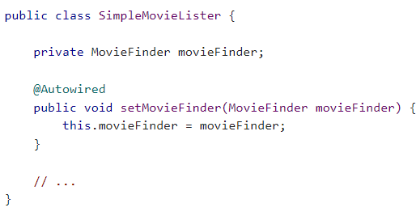

#spring注解 -ioc(控制反转)
1.applicationContext.xml，增加注解支持。
```xml
<?xml version="1.0" encoding="UTF-8"?>
<beans xmlns="http://www.springframework.org/schema/beans"
    xmlns:xsi="http://www.w3.org/2001/XMLSchema-instance"
    xmlns:context="http://www.springframework.org/schema/context"
    xsi:schemaLocation="http://www.springframework.org/schema/beans
        https://www.springframework.org/schema/beans/spring-beans.xsd
        http://www.springframework.org/schema/context
        https://www.springframework.org/schema/context/spring-context.xsd">
    <context:annotation-config/>
    <context:component-scan base-package="daoImpl"/>
    <bean id="mysqlDao" class="daoImpl.MysqlDaoImpl" autowire="byName"></bean>
</beans>
```
+ 注解驱动
`<context:annotation-config/>`


+ 包扫描
  + 路径下的类需要加入@Component注解
`<context:component-scan base-package="daoImpl"`
  

+ 注册bean
    + `<bean id="mysqlDao" class="daoImpl.MysqlDaoImpl" autowire="byName"></bean>`
    + id:beanId，bean的标识
    + class:bean的路径
    + autowired:自动注入(方式)
      + byName:通过名称匹配
      + byType:通过类型匹配
      + 用于构造函数
      
      + 用于setter方法上
      
    + @Resource
+ 注入外部属性 
  + @Value通常用于注入外部属性
+ 加入到spring容器注解。
    + @component
    + 衍生的注解：
      + @Repository（通常用于dao）
      + @Service（通常用户service）
      + @Controller(通常用于servlet)
    + （以上注解实际一个意思）
